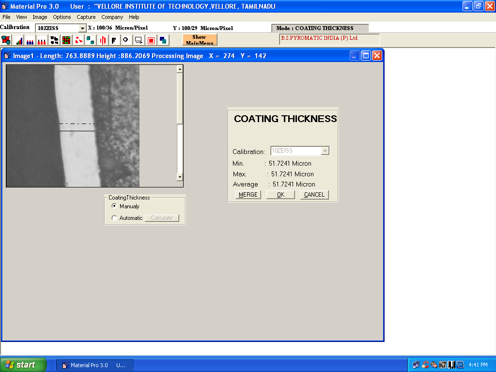
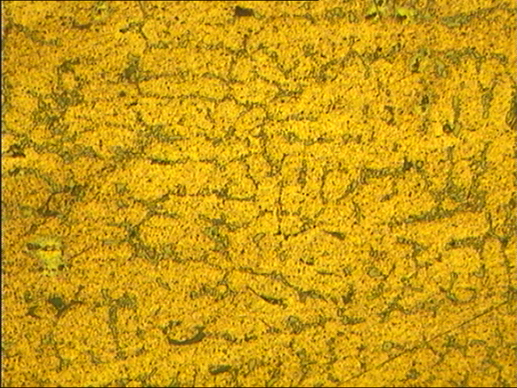
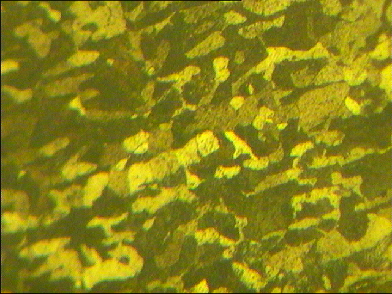
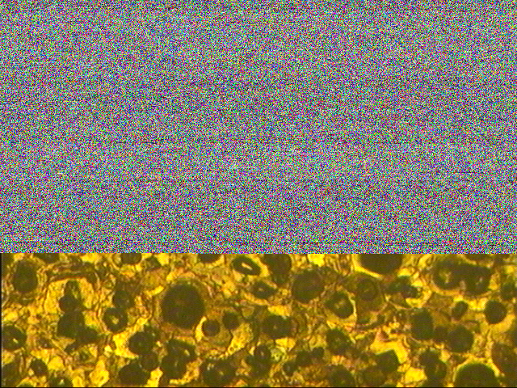
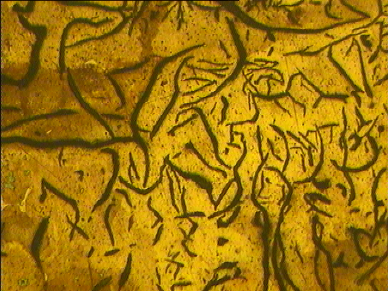

# MEE1005
Materials Engineering and Technology

---

### Observations:

#### Coating Thickness 

---

#### Al-Fe Alloy

---

#### Carbon Steel under observation:
##### spectral specimen

Low - LOW : Carbon Steel

---

#### C && Fe Alloy : LOW DOPE castironon 
##### C + Fe (Steel) Microstructure analysis by 14BME0133, VIT University
  
Medium - LOW : Carbon Steel

---

#### C && Fe Alloy : MEDIUM
##### Carbon Steel Microstructure analysis by 14BME0133, VIT University
  
Medium - MEDIUM : Carbon Steel

---

#### C && Fe Alloy : HIGH DOPE
##### Carbon Steel Microstructure analysis by 14BME0133, VIT University
  
High - MEDIUM : Carbon Steel

---

#### White = Cast Iron Alloy
##### Carbon Steel Microstructure analysis by 14BME0133, VIT University

---

####  b Nodular Cast Iron Alloy
##### Carbon Steel Microstructure analysis by 14BME0133, VIT University

---

#### cvbcx Grey Cast Iron Alloy
##### Carbon Steel Microstructure analysis by 14BME0133, VIT University

---

---

Mentored by Dr. Geetha M., CBST, VIT University
 - [x] Credits
  - [x] CC0 

---

<<SCRIPT>

(•_•)  
<)   )╯LOOK  
/    \   
   
\(•_•)   
(   (> FOR   
/    \   

 (•_•)   
<)   )>  N1X   
/    \   
   

---

(C) 2017-18 <a href="14bme0133.github.io"> < 1 4 B M E 0 1 3 3 /> </a>
All Directions Reserved.
