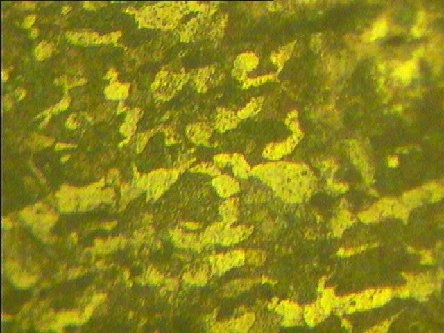
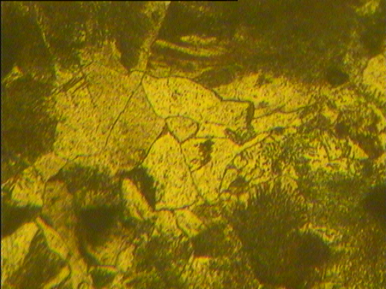

# MEE1005
Materials Engineering and Technology

---

### Observations:

#### Coating Thickness 

#### Al-Fe Alloy

#### Carbon Steel under observation:
##### spectral specimen

Low - LOW : Carbon Steel

#### C && Fe Alloy : LOW DOPEcastironon Steel Microstructure analysis by 14BME0133, VIT University

Medium - LOW : Carbon Steel

#### C && Fe Alloy : MEDIUM
##### Carbon Steel Microstructure analysis by 14BME0133, VIT University

Medium - MEDIUM : Carbon Steel

#### C && Fe Alloy : HIGH DOPE
##### Carbon Steel Microstructure analysis by 14BME0133, VIT University

High - MEDIUM : Carbon Steel

#### C && Fe : CWhiteast Iron Alloy
##### Carbon Steel Microstructure analysis by 14BME0133, VIT University

#### C && Fe : NodularCast Iron Alloy
##### Carbon Steel Microstructure analysis by 14BME0133, VIT University

#### C && Fe : Grey Cast Iron Alloy
##### Carbon Steel Microstructure analysis by 14BME0133, VIT University

---

Mentored by Dr. Geetha M., CBST, VIT University
 - [x] Credits

---

<<SCRIPT>

(•_•)  
<)   )╯LOOK  
/    \   
   
\(•_•)   
(   (> FOR   
/    \   

 (•_•)   
<)   )>  DIS   
/    \   
   

---

(C) 2017-18 <a href="14bme0133.github.io"> /< 1 4 B M E 0 1 3 3 /> </a>
